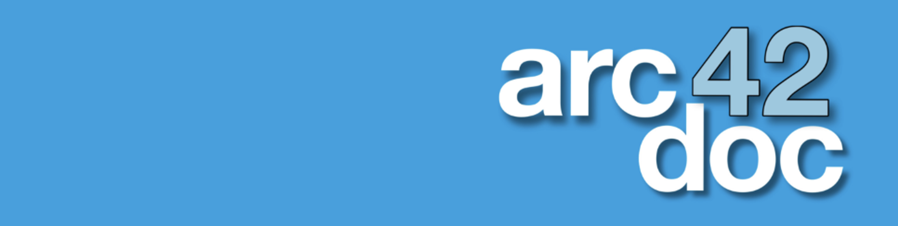

<h1 align="center" style="display: block; font-size: 2.5em; font-weight: bold; margin-block-start: 1em; margin-block-end: 1em;">

</h1>

# arc42doc: Documentation tool for software architectures</strong>

  
   
  
    
      

Contributers: 
Prof. Dr. Sascha Alda, 
Klara Golubovic,
John Meyerhoff,
Marie Becker,
Fiona Schwindt,
Simon Biwer, 
Tobias Fellechner,
Ange Nasser Modjo
___

### Contents

[Motivation](#motivation) 
[Installation](#installation) 
[Vaadin help](#vaadin) 
[Project Information](#project)
<!--[Bachelor- und Master-Thesen](#Bachelor-und-Master-Thesen) -->
 

## What is arc42doc? 
Arc42doc is a documentation tool for software architectures, based on the structure of the [arc42 template](https://arc42.org).

To organize the documentation of your software architecture we built arc42doc to help and guide in completing a detailed and well structured overview of your documentation progress.   

To present some of the features of our tool, arc42doc, we’ve compiled a list of our top 10 features:

1. **Based on the arc42 template**, we provide 12 categories to ensure that your documentation is automatically structured from the beginning! Through the sidebar, you can get an overview of all the categories and subcategories that you might use in your documentation.

2. **Create as many project documentations as needed** and get an overview of them on our landing page. Each documentation is assigned an ID for distinction, with the table on the landing page displaying its documentation progress.

3. **Documentation management:** Easily manage and update your documents as your project evolves.

4. **We added a 13th step,** which is not part of the arc42 template but is crucial for software projects: Energy Smell analysis with a SonarQube setup!

5. **Analyze your risks** using risk management methods such as checklists, questionnaires, SWOT analysis, and risk maps.

6. **Upload and describe your Building Block, Runtime, and Deployment views!** PNG and UXF file uploads are supported.

7. **Documenting your quality scenarios** is essential — arc42doc offers a range of fields to fill in and visualize as a colourful, structured tree.

8. **Profile management:** Every employee has their own account to participate in the documentation process. Commenting features, role descriptions, and more are coming soon!

9.  **Having detailed and complete documentation** is crucial! In arc42doc, you can evaluate the completeness and status of your entire documentation with just one click. Additionally, you can set the weights for each category. What’s more important to you can be given more weight in the overall evaluation!

10. Taking in consideration the **sustainability of your project**, we also offer a Sustainability Board to track your meetings per year, the completness of your documentation as well as other important aspects of your project work. 

## 💡 Motivation 
**Our current deployment can be accessed on the H-BRS intranet [http://arc42doc.inf.h-brs.de](http://arc42doc.inf.h-brs.de/) if you have VPN access.**

The tool was developed by several students as part of a project supervised by Professor Dr. Alda at the Bonn-Rhein-Sieg University.

| **Name**         | **Link**                                                                               |
| ---------------- | -------------------------------------------------------------------------------------- |
| Arc42-Template   | [https://www.arc42.de/overview/](https://www.arc42.de/overview/)                       |
| Vaadin Framework | [https://vaadin.com/docs/latest/components](https://vaadin.com/docs/latest/components) |
| Datenbank Neo4j  | [https://neo4j.com/docs/](https://neo4j.com/docs/)                                     |

## ⚙️ Installation 

For the installation and execution of the tool with localhost, a valid VPN connection to our university must first be established. You can find instructions here:

[https://faq.infcs.de/](https://faq.infcs.de/)

(Login is required as the page is located on our intranet.)

The source code is downloaded from the university's internal GitLab, where each team is provided with their own GitLab repository.

Maven-Setup

Starten Sie mit `mvn jetty:run` und öffnen Sie [localhost:8080](http://localhost:8080) im Browser.

Wenn Sie Ihre Anwendung lokal im Produktionsmodus ausführen möchten, führen Sie `mvn jetty:run -Pproduction` aus.

Installation of neo4j-database

 
To use Neo4j, you must first download the desktop version [here](https://neo4j.com/download-center/#desktop). After installing Neo4j, you can add a local DBMS with the following configuration:
  

**Please choose your own neo4j-database credentials!**

1. **Name**: `neo4j`
2. **Password**: `yourPassword`
3. **Version**: `4.4.5`

Then, start the server.

Create an Arc42 documentation

 
To create an account in the database for documentation purposes, you need to first visit: [localhost:8080](http://localhost:8080) 
There, you can click on "Noch kein Konto? Hier registrieren!" (which translates to "Don't have an account yet? Register here!"). After registering, you should be able to log in without any issues and proceed to create documentation.

## 🎓 Project Information

This project was initiated and supervised by [Professor Dr. Sascha Alda ](https://www.h-brs.de/de/inf/prof-dr-sascha-alda) at the [Bonn-Rhein-Sieg University of Applied Sciences](https://www.h-brs.de/en). Several students developed their Bachelor's and Master's theses as part of this project.  
The license of this project:

Theses contirbuting to the arc42doc: 
* Ange Nasser Modjo: "Analyse und Verwaltung von architektonischen Entwurfsentscheidungen" (Masterthesis, Juli 2021)
* Tobias Fellechner: "Re-Engineering eines bestehenden Tools für die Dokumentation von Software-Architekturen" (Bachelorthesis, Mai 2022)
* Fiona Schwindt: "Integration ökologischer Aspekte in ein Framework zur Dokumentation von Software-Architekturen" (Bachelorthesis, August 2023)
* Klara Golubovic: "Integration von Risikomanagement in ein Tool zur Dokumentation von Software-Architekturen" (Bachelorthesis, August 2023)
* Simon Biwer: "Regelbasierte Bewertung von Software-Architekture-Dokumentationen" (Bachelorthesis, März 2024)
* Marie Becker: "Konzeption und erste Prototypentwicklung für eine ganzheitliche Bewertung der Energieeffizienz von Softwareprojekten" (Masterprojekt, Januar 2024); 
* Marie Becker: "Weiterentwicklung und Integration eines Prototyps für die Dokumentation und energetische Bewertung von Softwareprojekten" (Masterthesis, August 2024)
* John Meyerhoff: "Integration von Linting­Verfahren in ein Tool zur Dokumentation und Bewertung von Software­Architekturen" (Bachelorthesis, ongoing)

---
🐞 **Notice regarding detected bug:** 
Currently, there are still some minor bugs that will be improved in near future. We have many ideas to implement and thereby take it step by step. Nevertheless, feel free to contribute to our project or even sent us some of your ideas! 

## ⚠️ License
This project arc42doc is free and open-source software licensed under the GNU General Public License v3.0.
